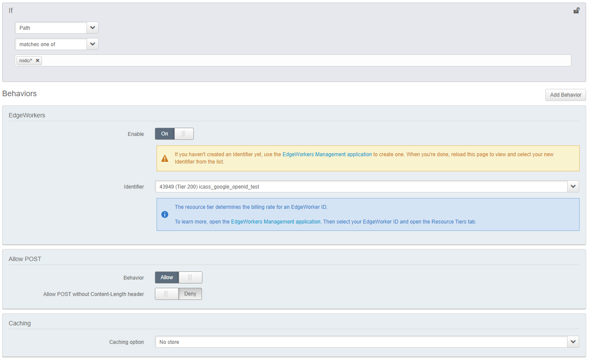
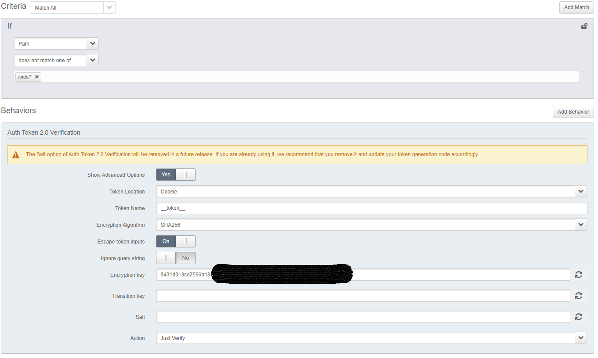
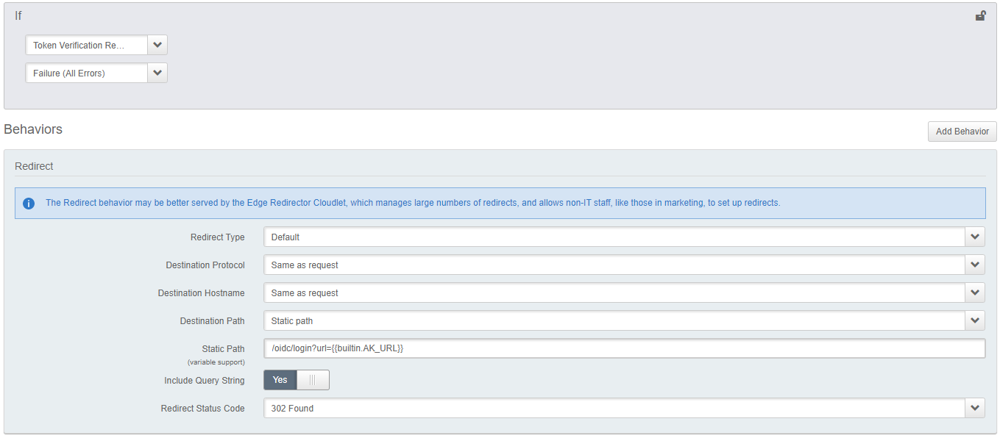
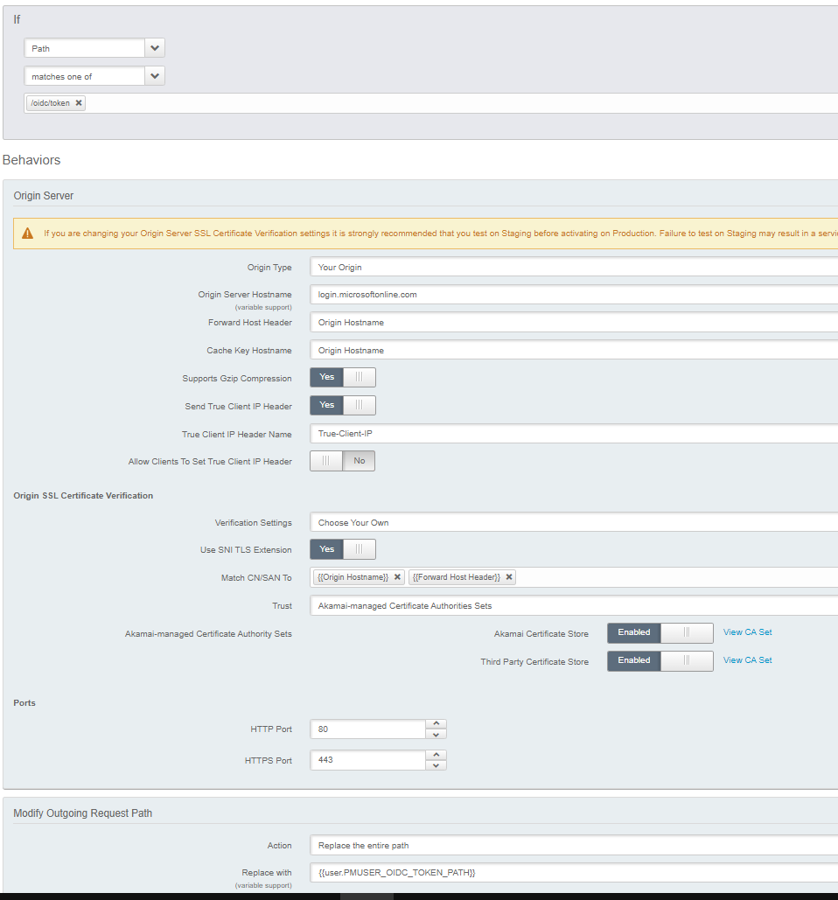

# OpenID Connect at the Akamai Edge

**DISCLAIMER: This code is designed to be used as an example only. No guarantees are made that it's fit for purpose. It's not production ready and should not be used to protect critical resources**

This EdgeWorker is designed to protect an Akamaized site using OpenID Connect (OIDC) in combination with Akamai Token Authentication. The Akamai Authentication token is presented as a cookie and is created upon successful authentication by your IdP. The first time you access, you'd expect to follow the "Invalid Token" flow to log in, then your access would continue unhindered until the token expires.

The flow is as follows:-

## Components
- Akamai Property Manager Configuration
- Akamai Edgeworker
- An OpenID Connect Identity Provider, for example Google or Azure

## IDP provider Configuration
The application needs to be configured at the IDP provider. 

### Google
https://developers.google.com/identity/protocols/oauth2/openid-connect
   - Authentication URL - https://accounts.google.com/o/oauth2/v2/auth
   - Token URL - https://oauth2.googleapis.com/token

### Azure
https://docs.microsoft.com/en-us/azure/active-directory/develop/v2-protocols-oidc
   - Authentication URL - https://login.microsoftonline.com/{tenant}/oauth2/v2.0/authorize
   - Token URL - https://login.microsoftonline.com/{tenant}/oauth2/v2.0/token

## Edgeworker
Download this repository. Tar and gzip the contents of the "edgeworker" folder and deploy to Akamai. https://techdocs.akamai.com/edgeworkers/docs/create-a-code-bundle

## Property Manager
Some rules are required to be added to Property Manager to enforce authentication. The EdgeWorker is only invoked during login time. When a valid Akamai Edge Token is available, access will be granted without involvement of the EdgeWorker.

### Variables
Property Manager Variables are required to be added in order to share the required credentials with the EdgeWorker. These should be configured as "hidden". Do not set these to "sensitive" or the Edge Worker will not be able to access them. Do not leave them as "visible" or anyone can view them using Akamai Debug Headers

1. OIDC_AKSECRET - The same key as contained in the Akamai "Token Authentication" behaviour. Copy/paste it here.
2. OIDC_CLIENTID - The client id as generated by the OpenID provider
3. OIDC_SECRET - The secret as generated by the OpenID provider
4. OIDC_AUTH_URL - The full url for authentication with the IdP (see section above)
5. OIDC_TOKEN_PATH - The path for validation of the token with the IdP. Must not include the protocol or hostname, only the path.

### Rules
Property Manager should be configured like so:-

1. Create an empty rule called "Authentication"
2. Create a child rule of "Authentication" called "Edgeworker"
   - IF path matches /oidc/*
      - Edgeworkers behaviour
      - Allow POST
      - Cache Rule = no-store (important to make sure Set-Cookie gets returned)

5. Create a child rule of "Authentication" called "Token Validation". This contains the logic to check the Akamai Authentication Token and redirect to the login endpoint if it's invalid. _Note, if using Google, salt should be specified as the domain name for the organization so that you can't use any Google account to log in. You can leave salt blank for Azure_
   - IF NOT path matches /oidc/*
      - Validate token (just verify)

6. Create a child rule of "Token Validation" called "Not Valid?"
   - IF NOT valid token
      - Redirect /oidc/login?url={{builtin.AK_URL}}

7. Create a child rule of "Authentication" called "OpenID Token Validation". This rule needs to exist because the Edgeworker cannot talk directly to Google or Azure so the token validation requests need to proxy through Akamai. We therefore treat the IDP as an origin for any requests that are made to /oidc/token
   - IF path matches /oidc/token
     - Origin behaviour = Hostname = <token hostname>, Forward Host Header = origin hostname
     - Path overriden to OIDC_TOKEN_PATH
 
 

## Known Limitations
Not implemented yet, amongs others:
- Logout
- Other IDP providers (tested with Google and Azure)
- More fine-grained authorization. This Edgeworker currently allows anyone from the same org to access. It does not check per-user roles or permissions
