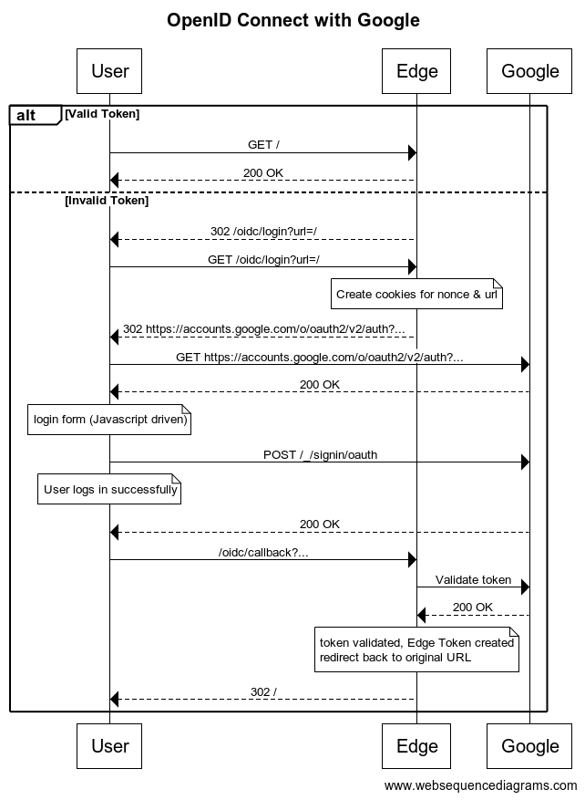

# OpenID Connect at the Akamai Edge
This EdgeWorker is designed to protect an Akamaized site using OpenID Connect (OIDC) in combination with Akamai Token Authentication. The Akamai Authentication token is presented as a cookie and is created upon successful authentication by your IdP. The first time you access, you'd expect to follow the "Invalid Token" flow to log in, then your access would continue unhindered until the token expires.

The flow is as follows:-

Note, this example code uses Google as the IdP but it's expected that it can be easily swapped out for any OIDC IdP.

## Components
- Akamai Edge Server (Running this Edgeworker and a Property Manager configuration
- Identity Provider, for example Google

## EdgeWorker resources
The EdgeWorker currently supports the following resources:

### /.../login?url=redirect-url
Initiate the login process.

Parameters:
- url: Used upon successful login to redirect to the original requested url. Default /
- 
### /.../callback?code=authorization-code
Used upon successful authentication at the IDP to request the JWT tokens, create the akamai_token and perform the redirect to the original requested url.

## IDP provider
The application needs to be configured at the IDP provider. 

Example for Google:
https://developers.google.com/identity/protocols/oauth2/openid-connect
1. IDP domain
   - Authentication URL - https://accounts.google.com/o/oauth2/v2/auth
   - Token URL - https://oauth2.googleapis.com/token
2. Application Configuration
   - Login URL - https://application.example.com/oidc/login
   - Redirect URL - https://application.example.com/oidc/callback
   - Token URL - https://application.example.com/oidc/token - should proxy to https://oauth2.googleapis.com/token

Example for Azure:
https://docs.microsoft.com/en-us/azure/active-directory/develop/v2-protocols-oidc
1. IDP domain
   - Authentication URL - https://login.microsoftonline.com/{tenant}/oauth2/v2.0/authorize
   - Token URL - https://login.microsoftonline.com/{tenant}/oauth2/v2.0/token
2. Application Configuration
   - Login URL - https://application.example.com/oidc/login
   - Redirect URL - https://application.example.com/oidc/callback
   - Token URL - https://application.example.com/oidc/token - should proxy to https://login.microsoftonline.com/{tenant}/oauth2/v2.0/token

## Property Manager - application
The application involves the EdgeWorker only during login time. When a valid and not-expired token is available access will be granted without involvement of the EdgeWorker.

### Variables
User defined variables are required in order to share the required credentials with the EdgeWorker.
1. OIDC_AKSECRET - The key used to generate the token
1. OIDC_CLIENTID - The client id of the OpenID provider
1. OIDC_SECRET - The secret to be used in combination with the client id 
1. OIDC_AUTH_URL - The url for authentication with the IdP

### Rules
At the application level their needs the following rules:
1. An unprotected path to involve the EdgeWorker
   - IF path matches /oidc/*
      - Edgeworker
      - Cache Rule = no-store (to make sure Set-Cookie gets returned)
      - Allow POST
1. Protected area's are protected using an Akamai token (using the key as specified in OIDC_AKSECRET). Note, if using Google, salt should be specified as the domain name for the organization so that you can't use any Google account to log in. You can leave this blank for Azure
   - IF NOT path matches /oidc/*
      - Validate token
      - IF NOT valid token
         - Redirect /oidc/login?url=urlEncode(URL)
1. If path matches /oidc/token
    - Origin = <token hostname>
    - Path overriden to <token path>

To be used as sample code. Lots of topics not implemented yet, amongs others:
- Logout
- Other IDP providers (tested with Google and Azure)
- More fine-grained authorization. This Edgeworker currently allows anyone from the same org to access. It does not check per-user permissions
