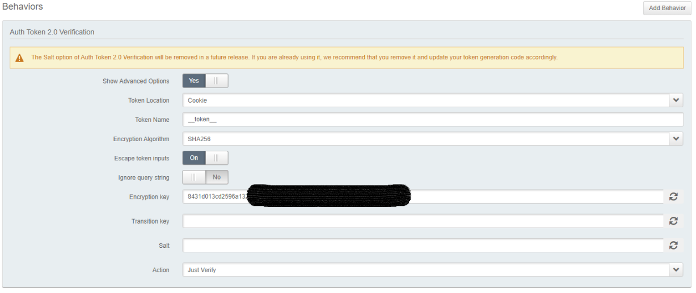
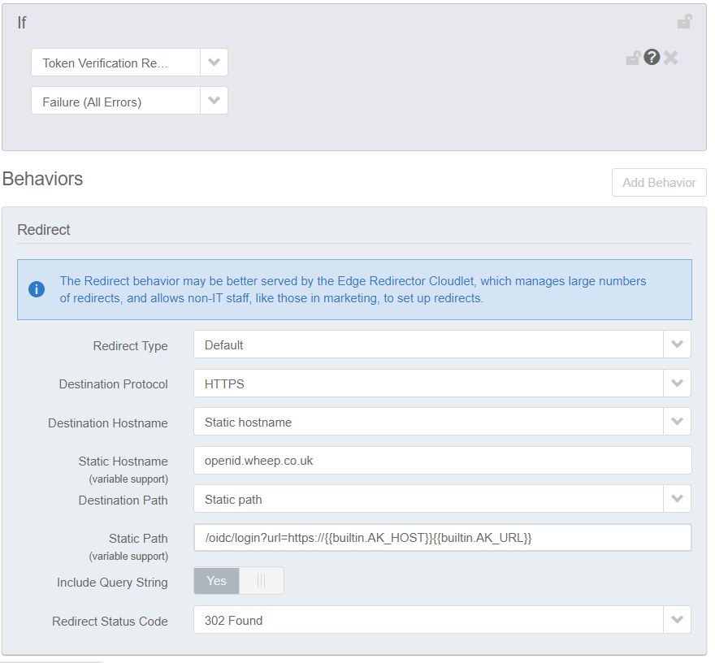
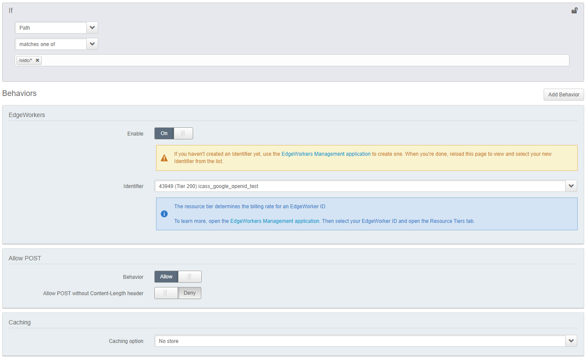
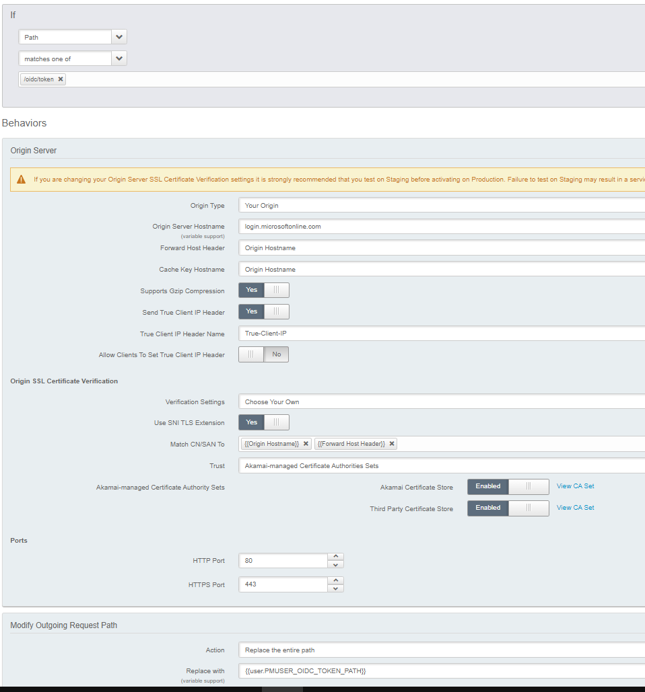

# OpenID Connect at the Akamai Edge

**DISCLAIMER: This code is designed to be used as an example only. No guarantees are made that it's fit for purpose. It's not production ready and should not be used to protect critical resources**

This EdgeWorker is designed to protect an Akamaized site using OpenID Connect (OIDC) in combination with Akamai Token Authentication. This particular recipe is for a Single Sign On site for your whole domain. Initial configuration is a little more involved but once set up, it's easier to add more sites.

After successful authentication by your IdP, an Akamai Authentication token is sent as a cookie to your browser. The first time you access, you'd expect to follow the "Invalid Token" flow to log in, then your access would continue unhindered until the token expires.

The flow is as follows:-

## Components
- Akamai Property Manager Configuration for your site
- A New Akamai Property Manager Configuration for the login endpoint
- Akamai Edgeworker
- An OpenID Connect Identity Provider, for example Google or Azure

## IDP provider Configuration
The application needs to be configured at the IDP provider. 

### Google
https://developers.google.com/identity/protocols/oauth2/openid-connect
   - Authentication URL - https://accounts.google.com/o/oauth2/v2/auth
   - Token URL - https://oauth2.googleapis.com/token

### Azure
https://docs.microsoft.com/en-us/azure/active-directory/develop/v2-protocols-oidc
   - Authentication URL - https://login.microsoftonline.com/{tenant}/oauth2/v2.0/authorize
   - Token URL - https://login.microsoftonline.com/{tenant}/oauth2/v2.0/token

## Edgeworker
Download this repository. Tar and gzip the contents of the "edgeworker" folder, and deploy to Akamai using a "dynamic compute" resource tier. https://techdocs.akamai.com/edgeworkers/docs/create-a-code-bundle

## Your Existing Property Manager Property
A new rule will need to be added to your existing Property Manager property to enforce token authentication and to redirect to the login site if there's no valid token

### Rules
1) Create a rule called "Token Validation". You don't need any match conditions.

6. Create a child rule of "Token Validation" called "Not Valid?"
   - IF NOT valid token
      - Redirect https://login.domain.com/oidc/login?url=https://{{builtin.AK_HOST}}{{builtin.AK_URL}}

## New Property Manager Property for Login Site
A new Property Manager configuration will need to be set up for the Login site. You can use Netstorage as the origin serving a placeholder home page. You'll also need to create a new certificate for this site in Akamai Control Panel.

Other than the basic configuration, you'll need to add specific configuraton as described below.

### Variables
Property Manager Variables are required to be added in order to share the required credentials with the EdgeWorker. These should be configured as "hidden". Do not set these to "sensitive" or the Edge Worker will not be able to access them. Do not leave them as "visible" or anyone can view them using Akamai Debug Headers

1. OIDC_AKSECRET - The same key as contained in the Akamai "Token Authentication" behaviour. Copy/paste it here.
2. OIDC_CLIENTID - The client id as generated by the OpenID provider
3. OIDC_SECRET - The secret as generated by the OpenID provider
4. OIDC_AUTH_URL - The full url for authentication with the IdP (see section above)
5. OIDC_TOKEN_PATH - The path for validation of the token with the IdP. Must not include the protocol or hostname, only the path.

### Rules
Property Manager should be configured like so:-

1. Create an empty rule called "Edgeworker"
   - IF path matches /oidc/*
      - Edgeworkers behaviour
      - Allow POST
      - Cache Rule = no-store (important to make sure Set-Cookie gets returned)

2. Create a child rule of "Authentication" called "OpenID Token Validation". This rule needs to exist because the Edgeworker cannot talk directly to your OpenID provider so the token validation requests need to proxy through Akamai. We therefore treat the OpenID Provider as an origin for any requests that are made to /oidc/token
   - IF path matches /oidc/token
     - Origin behaviour = Hostname = <token hostname>, Forward Host Header = origin hostname
     - Path overriden to OIDC_TOKEN_PATH
 
 

## Known Limitations
Not implemented yet, amongs others:
- Logout
- Other IDP providers (tested with Google and Azure)
- More fine-grained authorization. This Edgeworker currently allows anyone from the same org to access. It does not check per-user roles or permissions
